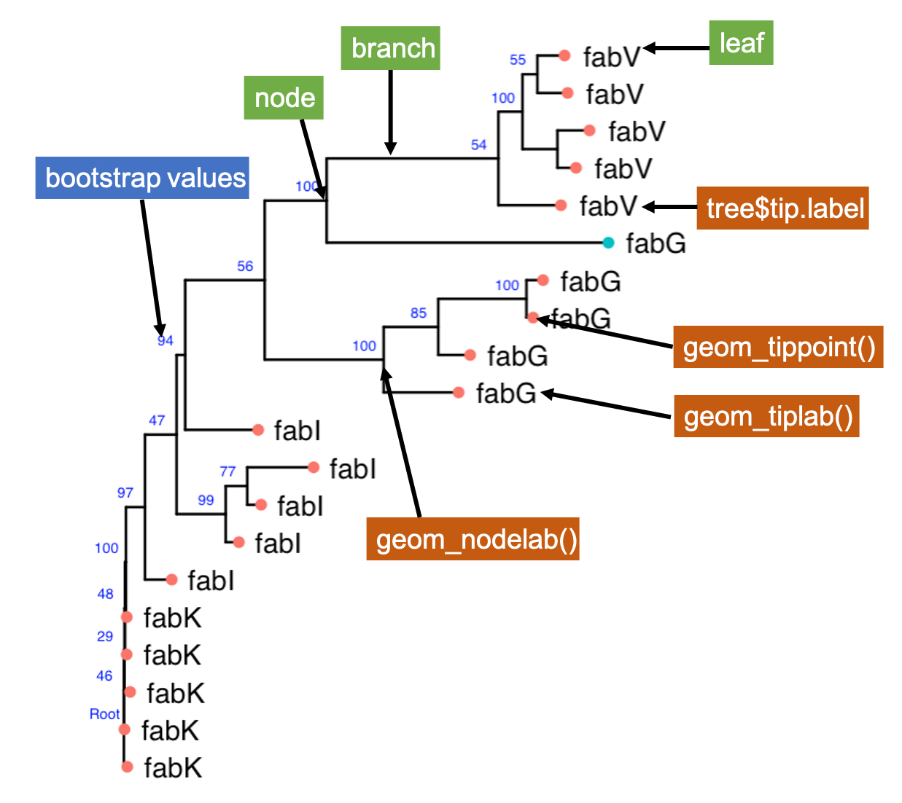

# Welcome to R: Building Phylogenetic Trees with ggtree

In this workshop you will learn how to work with phylogenetic trees programatically using R, particularly using the package [ggtree](https://yulab-smu.top/treedata-book/index.html)

## Workshop overview

### Day 1: 100% of what you need to know to make basic trees in R

- Reading in different phylogenetic tree file types

- Plotting trees

### Day 2: Neatly associating trees with complimentary data

- Using metadata to subset and highlight features of a tree 

- Plot trees alongside heatmaps

### Day 3: Incorporating trees with quantitative data

- Adding ancestral reconstruction state data to trees

- Comparing and visualizing different tree topologies

- Plotting trees with bar plots

## Session files

There are three R Markdown (.rmd) files for each day of the workshop. 

There are also three R Markdown files containing the answers to each of the day's exercises. 

Each day has a knitted R Markdown .html file that can be used as a reference. Exercise code is left unrun.

## Running workshop code

Click on the green Code button and choose Download Zip, unzip the folder on your computer, open the appropriate R Markdown file. 

Please make sure that you have all packages installed! The `install.packages()` command for each package is included in the first code cell of each R Markdown file.

## Parts of a tree

Here are some useful terms to know when working with trees. The `ggtree()` equiavalents are highlighted in maroon.

## Reductase gene metadata

The metadata used throughout the workshop for reference.

---

## Acknowledgements and references 

[Northwestern University Information Technology Research Computing Services](https://github.com/nuitrcs)

Special thanks to [Colby Witherup Wood](https://github.com/aGitHasNoName) for their assistance

G Yu. Using ggtree to visualize data on tree-like structures. Current Protocols in Bioinformatics, 2020, 69:e96. doi: 10.1002/cpbi.96.

G Yu*, TTY Lam, H Zhu, Y Guan*. Two methods for mapping and visualizing associated data on phylogeny using ggtree. Molecular Biology and Evolution, 2018, 35(2):3041-3043. doi: 10.1093/molbev/msy194.

G Yu, DK Smith, H Zhu, Y Guan, TTY Lam*. ggtree: an R package for visualization and annotation of phylogenetic trees with their covariates and other associated data. Methods in Ecology and Evolution. 2017, 8(1):28-36. doi: 10.1111/2041-210X.12628.
